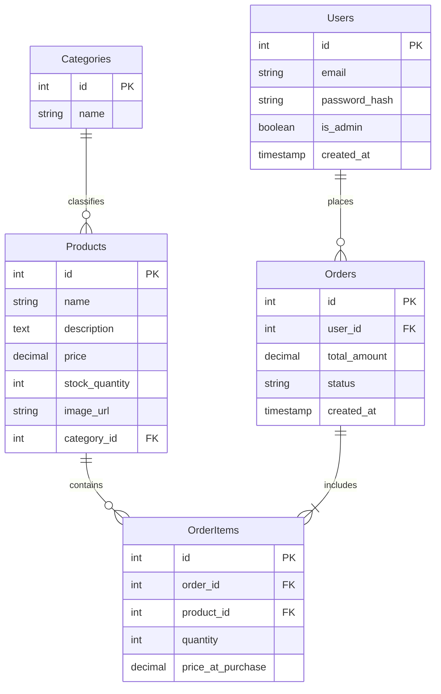

# Architectural Design Document (ADD)
## Project: Basic E-Commerce Website

---

## 1. Introduction

### 1.1 Purpose
The purpose of this Architectural Design Document (ADD) is to define the high-level and low-level architectural choices for the Basic E-Commerce Website. It serves as the blueprint for the development team, ensuring that the chosen technologies (React JS, FastAPI, PostgreSQL) are implemented cohesively to meet the requirements defined in the BRD and UI/UX documents.

### 1.2 High-Level Description
The system is a modern, web-based e-commerce application designed using a decoupled client-server architecture.
-   **The Frontend** is a Single Page Application (SPA) built with **React JS**, providing a dynamic and responsive user interface.
-   **The Backend** is a high-performance RESTful API built with **FastAPI** (Python), handling business logic, authentication, and data processing.
-   **The Database** is **PostgreSQL** (hosted on Neon), serving as the persistent storage for products, users, and orders.

---

## 2. Architecture Overview

### 2.1 System Architecture
The application follows a **Three-Tier Architecture**:
1.  **Presentation Layer (Client):** React JS application running in the user's browser.
2.  **Application Layer (Server):** FastAPI server exposing REST endpoints.
3.  **Data Layer (Database):** PostgreSQL database storing relational data.

### 2.2 Architecture Diagram

```mermaid
graph TD
    subgraph Client_Side [Frontend - React JS]
        UI[User Interface]
        State[State Management (Context/Redux)]
        API_Client[Axios/Fetch API]
    end

    subgraph Server_Side [Backend - FastAPI]
        API_Gateway[API Router]
        Auth_Service[Auth (JWT)]
        Biz_Logic[Business Logic Controllers]
        ORM[SQLAlchemy ORM]
    end

    subgraph Data_Storage [Database - Neon PostgreSQL]
        DB[(PostgreSQL)]
    end

    User((User)) -->|HTTPS| UI
    UI -->|User Action| State
    State -->|Request| API_Client
    API_Client -->|JSON/HTTPS| API_Gateway
    
    API_Gateway --> Auth_Service
    API_Gateway --> Biz_Logic
    Biz_Logic --> ORM
    ORM -->|SQL| DB
```

---

## 3. Application Architecture

### 3.1 Frontend Design (React JS)
*   **Framework:** React JS (v18+)
*   **Routing:** React Router v6 for client-side navigation.
*   **State Management:** React Context API (for shopping cart and user session) or Redux Toolkit if complexity grows.
*   **Styling:** CSS Modules or Tailwind CSS (for responsive, component-scoped styling).
*   **HTTP Client:** Axios for making asynchronous requests to the FastAPI backend.
*   **Key Components:**
    *   `App`: Main entry point and router setup.
    *   `Layout`: Header, Footer, and main content wrapper.
    *   `ProductCard`, `CartDrawer`, `CheckoutForm`: Reusable UI components.

### 3.2 Backend Design (FastAPI)
*   **Framework:** FastAPI (Python 3.10+) known for speed and auto-generation of OpenAPI docs.
*   **Server:** Uvicorn (ASGI server).
*   **API Structure:** RESTful principles (GET, POST, PUT, DELETE).
*   **Validation:** Pydantic models for request/response validation and serialization.
*   **Concurrency:** Async/Await syntax for non-blocking I/O operations.

### 3.3 APIs and Integrations
*   **ORM (Object-Relational Mapping):** **SQLAlchemy** (Async engine) will be used to interact with the database.
*   **Migrations:** **Alembic** will manage database schema changes and versioning.
*   **Payment Gateway:** Integration with a provider like Stripe via their SDK/API (Backend handles intent creation, Frontend handles confirmation).

---

## 4. Data Architecture

### 4.1 Database Design
The database will be **PostgreSQL** hosted on **Neon**.

#### ER Diagram


### 4.2 Data Flow
1.  **Read:** Frontend requests data -> FastAPI Endpoint -> SQLAlchemy Query -> DB -> Response (Pydantic Model) -> Frontend Display.
2.  **Write:** Frontend sends JSON -> FastAPI Endpoint (Validation) -> SQLAlchemy Session -> DB Commit -> Success Response.

---

## 5. Technology Stack

| Component | Technology | Version / Note |
| :--- | :--- | :--- |
| **Frontend** | React JS | Latest Stable |
| **Frontend Libs**| React Router, Axios, Formik | |
| **Backend** | Python | 3.10+ |
| **API Framework**| FastAPI | |
| **Database** | PostgreSQL | 14+ (Neon) |
| **ORM** | SQLAlchemy | Async Support |
| **Migrations** | Alembic | |
| **Environment** | Node.js (Dev), Python venv | |

---

## 6. Security Architecture

### 6.1 Authentication and Authorization
*   **Authentication:** JSON Web Tokens (JWT). Users log in to receive an `access_token` (and optionally a `refresh_token`), which is sent in the `Authorization: Bearer` header for subsequent requests.
*   **Password Hashing:** `bcrypt` or `Argon2` context via `passlib` to hash passwords before storage.
*   **Authorization:** Role-Based Access Control (RBAC). Middleware to check if the user has `is_admin=True` for protected administrative endpoints.

### 6.2 Data Protection
*   **Transmission:** All traffic enforced over HTTPS (TLS 1.2+).
*   **Input Sanitization:** Pydantic models prevent injection attacks by strictly typing and validating inputs. SQLAlchemy parameter binding prevents SQL Injection.
*   **CORS:** Strictly configured Cross-Origin Resource Sharing policy to allow requests only from the frontend domain.

---

## 7. Deployment Architecture

### 7.1 Hosting Environment
*   **Frontend:** Deployed to a static site host (e.g., Vercel, Netlify, or AWS S3+CloudFront).
*   **Backend:** Deployed to a containerized platform or PaaS (e.g., **Render**, Railway, or AWS ECS).
*   **Database:** **Neon** Serverless PostgreSQL.

### 7.2 CI/CD Pipeline
*   **Source Control:** GitHub Repository.
*   **Actions:** GitHub Actions or similar to run linters (ESLint, Flake8) and tests (Jest, Pytest) on push.
*   **Deploy:** Auto-deploy on merge to `main` branch.

---

## 8. Non-Functional Considerations

*   **Reliability:** The backend handles exceptions gracefully, returning standardized HTTP error codes (4xx, 5xx) and JSON error messages.
*   **Maintainability:** Codebase organized by domain (Routers, Schemas, Models, Services) to ensure separation of concerns.
*   **Performance:**
    *   Frontend: Code splitting and lazy loading of routes.
    *   Backend: Async endpoints to handle high concurrency.
    *   DB: Indexing on frequently searched columns (e.g., `product.name`, `user.email`).
*   **Availability:** Use of managed services (Neon, PaaS) minimizes infrastructure maintenance downtime.
